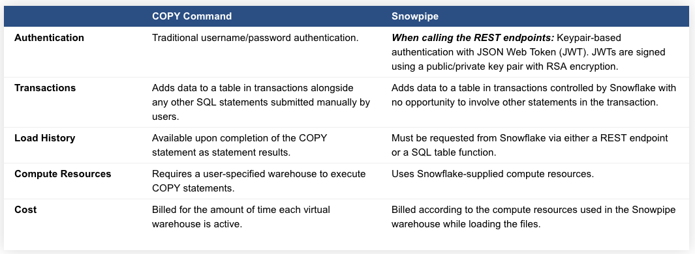

# SNOWPIPE DEMO
### Prepared for SNOWFLAKE USER GROUP – HELSINKI (2018-10-24)
### @ VR Group 

Snowflake Data Loading with Snowpipe

## Introduction to Snowpipe

    Snowpipe enables loading data from files as soon as they’re available in a stage. 
    This means you can load data from files in micro-batches, making it available to 
    users within minutes, rather than manually executing COPY statements on a schedule 
    to load larger batches.

    https://docs.snowflake.net/manuals/user-guide/data-load-snowpipe-intro.html
    
    Note that Snowpipe is currently a preview feature; however, accounts that try the service are 
    still billed based on usage.

The following table briefly describes the primary differences between Snowpipe and a traditional manual data 
load workflow using the COPY command.



For the most efficient and cost-effective load experience with Snowpipe, Snowflake recommends creating data files 
sized **between 1 to 10 MB compressed and staging them once per minute**. This approach typically leads to a good 
balance between cost (i.e. resources spent on Snowpipe queue management and the actual load) and performance 
(i.e. load latency). For more information, check https://docs.snowflake.net/manuals/user-guide/data-load-considerations-prepare.html#label-snowpipe-file-size

## Let's Get Started

1. Create file format (if you didn't create it before!)
    https://docs.snowflake.net/manuals/sql-reference/sql/create-file-format.html
    
    First create a schema in where you keep your file formats
    ```mysql-psql
    CREATE OR REPLACE SCHEMA file_format_info;
    ```
    
    ```mysql-psql
    CREATE OR REPLACE FILE FORMAT file_format_info.json_array
    TYPE = 'JSON'
    COMPRESSION = 'AUTO'
    ENABLE_OCTAL = FALSE
    ALLOW_DUPLICATE = FALSE
    STRIP_OUTER_ARRAY = TRUE
    STRIP_NULL_VALUES = TRUE
    IGNORE_UTF8_ERRORS = FALSE
    COMMENT = 'JSON array';
    ```
    
    ```mysql-psql
    CREATE OR REPLACE FILE FORMAT file_format_info.tsv
    TYPE = 'CSV'
    COMPRESSION = 'AUTO'
    FIELD_DELIMITER = '\t'
    RECORD_DELIMITER = '\n'
    SKIP_HEADER = 1
    TRIM_SPACE = FALSE
    ERROR_ON_COLUMN_COUNT_MISMATCH = TRUE
    ESCAPE = 'NONE'
    ESCAPE_UNENCLOSED_FIELD = 'NONE'
    DATE_FORMAT = 'YYYY-MM-DD'
    TIMESTAMP_FORMAT = 'AUTO'
    NULL_IF = ('')
    COMMENT = 'Tab separated file';
    ```

2. Create a S3 Bucket in AWS S3
    * You can use AWS Console or awscli to do that.
    * Bucket, called "minerva-test-integration-in-snowpipe-demo", has been created for this demo.

3. Create Schema and necessary Tables in Snowflake
    ```mysql-psql
    CREATE OR REPLACE SCHEMA snowpipe_demo;
    ```
    
    ```mysql-psql
    CREATE OR REPLACE TABLE raw_data (
    id BIGINT NOT NULL AUTOINCREMENT PRIMARY KEY COMMENT 'Auto incremented IDs',
    json_data VARIANT COMMENT 'JSON data',
    loading_ts TIMESTAMP with time zone NOT NULL DEFAULT CURRENT_TIMESTAMP COMMENT 'Timestamp when data is loaded to Snowflake'
    );
    ```
    
    ```mysql-psql
    CREATE OR REPLACE TABLE tsv_data (
    id BIGINT NOT NULL AUTOINCREMENT PRIMARY KEY COMMENT 'Auto incremented IDs',
    twitter_user_name VARCHAR(255) NOT NULL COMMENT 'Twitter user name which are used in script while searching',
    tweet VARCHAR(300) COMMENT 'Actual tweet. Max 280 Character but I used 300',
    tweet_language VARCHAR(50) COMMENT 'Tweet language',
    tweet_timestamp TIMESTAMP COMMENT 'Tweet creation timestamp',
    loading_ts TIMESTAMP with time zone NOT NULL DEFAULT CURRENT_TIMESTAMP COMMENT 'Timestamp when data is loaded to Snowflake'
    );
    ```

4. Create an external s3 stage:
    ```mysql-psql
    CREATE OR REPLACE STAGE <stage_name> 
    url='s3://<bucketname>/<folder name>' 
    credentials=(AWS_KEY_ID='<enter>' AWS_SECRET_KEY='<enter>')
    file_format=<file_format>;
    ```
    
    In our case:
    
    ```mysql-psql
    CREATE OR REPLACE stage snowpipe_demo.raw_data_stage url='s3://minerva-test-integration-in-snowpipe-demo/data/raw/'
      credentials=(aws_key_id='abc' aws_secret_key='def')
      encryption=(TYPE='AWS_SSE_S3')
      file_format=file_format_info.json_array;

    CREATE OR REPLACE stage snowpipe_demo.tsv_data_stage url='s3://minerva-test-integration-in-snowpipe-demo/data/tsv/'
      credentials=(aws_key_id='abc' aws_secret_key='def')
      encryption=(TYPE='AWS_SSE_S3')
      file_format=file_format_info.tsv;
    ```
    
    NOTE:
     
        1. Stage location should be pointed to a folder location, not to a file.
        2. Make sure that AWS secret id and key has the right policy/credentials for creating stages.
        3. Make sure that stages are created. (You can use the query below. Since we didn't create the pipes yet,
        there should be no information in "notification channel" column when you run the query below.
        
    ```mysql-psql
    -- Verify the stages
    SHOW stages;
    ```
 
    You can also check the files in the remote stages with the following query:
    
    ```
    ls @snowpipe_demo.raw_data_stage;
    
    -- OR (These queries lists the files under defined bucket for the stages)
    
    ls @snowpipe_demo.tsv_data_stage;
    ```
 
5. Create a pipe using **auto_ingest=true**:
    ```mysql-psql
    CREATE OR REPLACE pipe <pipe_name> autoingest = true AS COPY INTO <schema_name>.<tablename> FROM @<stage_name>;
    ```
    
    In our case:
    
    ```mysql-psql
    CREATE OR REPLACE pipe snowpipe_demo.raw_data_pipe auto_ingest=true AS
    COPY INTO snowpipe_demo.raw_data (
        json_data,
        loading_ts)
    FROM (SELECT $1, current_timestamp() FROM @snowpipe_demo.raw_data_stage);
    ```
    
    ```mysql-psql
    CREATE OR REPLACE pipe snowpipe_demo.tsv_data_pipe auto_ingest=true AS
    COPY INTO snowpipe_demo.tsv_data (
        twitter_user_name,
        tweet,
        tweet_language,
        tweet_timestamp,
        loading_ts)
    FROM (SELECT $1, $2, $3, $4, current_timestamp() FROM @snowpipe_demo.tsv_data_stage);
    ```
    
    These won't load the data files in case of an error. If you would like to continue loading when 
    an error is encountered, you can use other values such as 'SKIP_FILE' or 'CONTINUE' for the 
    ON_ERROR option.
 
6. Verify the pipes that they are created:                                                                                                                                                        
   ```mysql-psql
   SHOW pipes;
   ```
   Note that notification channel column now has the Amazon Resource Name (ARN)
   Run ``` SHOW stages;``` to check the as well.
 
7. Setup SQS notification 

    * https://www.snowflake.com/blog/your-first-steps-with-snowpipe/
 
8. Run twitter_api.py (You can change the global variable called TWITTER_USER_NAME to collect different data for different user names)

    ```bash
    $ python3 twitter_api.py
    ```
    This will upload the files to S3 and trigger the EVENT via SQS for snowpipe data load.
 
9. Run the following to check if the uploaded file is in your stage location:
  
    ```mysql-psql
    ls @<stage_name>;
    ```
 
10. Wait for 10-15 seconds and check the result:

    ```mysql-psql
    SELECT * FROM <schema_name>.<tablename>;  
    ```
    
    ```mysql-psql
    SELECT * FROM snowpipe_demo.raw_data
    LIMIT 50;
    
    SELECT * FROM snowpipe_demo.tsv_data
    LIMIT 50;
    
    SELECT DISTINCT LOADING_TS, COUNT(*) FROM snowpipe_demo.raw_data
    GROUP BY LOADING_TS
    ORDER BY LOADING_TS;
    
    SELECT DISTINCT LOADING_TS, COUNT(*) FROM snowpipe_demo.tsv_data
    GROUP BY LOADING_TS
    ORDER BY LOADING_TS;
    
    SELECT * FROM snowpipe_demo.tsv_data
    WHERE twitter_user_name = 'niinisto'
    LIMIT 50;
    
    SELECT
        id,
        json_data:twitter_user_name AS twitter_user_name,
        json_data:text AS tweet, 
        json_data:lang AS tweet_language, 
        json_data:created_at AS tweet_timestamp,
        loading_ts
    FROM snowpipe_demo.raw_data
    WHERE json_data:twitter_user_name = 'niinisto'
    LIMIT 50;
    ```
    
11. To get more details on the load, one can query COPY_HISTORY view
    
    * https://docs.snowflake.net/manuals/sql-reference/functions/copy_history.html
    
    ```mysql-psql
    SELECT *
    FROM TABLE(information_schema.copy_history(table_name=>'MYTABLE', start_time=> dateadd(hours, -1, current_timestamp())))
    ```
    
    OR
    
    ```mysql-psql
    SELECT SYSTEM$PIPE_STATUS('snowpipe_demo.raw_data_pipe');
    SELECT SYSTEM$PIPE_STATUS('snowpipe_demo.tsv_data_pipe');
    ``` 

12. In order to review the status of Snowpipe jobs without having to query Snowflake with a warehouse. Snowflake API can be used.

    * https://docs.snowflake.net/manuals/user-guide/data-load-snowpipe-rest-apis.html#load-history-reports
   
    For python (Check Snowflake Ingest Manager):
        
        https://github.com/snowflakedb/snowflake-ingest-python

13. Clean up the stuff that have been built.
    
    ```mysql-psql
    -- This will delete everything (tables, stages, pipes under this schema as well as the schema.
    DROP SCHEMA snowpipe_demo;
    ```

## Additional Information

1. Copy Options:

    According to pipe creation which is given above, If there is any problem on the file, snowpipe won't load
    the file in Snowflake table (E.g. broken JSON file.). If you try also, reloading everything from the stage with
    the same COPY command, it will fail. In order to bypass failed files, you can use COPY_OPTIONS such as:
    
    Ref: https://docs.snowflake.net/manuals/sql-reference/sql/copy-into-table.html
    
    ```mysql-psql
    COPY INTO snowpipe_demo.raw_data (
        json_data,
        loading_ts)
    FROM (SELECT $1, current_timestamp() FROM @snowpipe_demo.raw_data_stage)
    ON_ERROR = SKIP_FILE;  -- This will skip the files which have ERRORs while loading.
    ```

## Conclusion

* Data LOAD can be done manually via COPY command or automatically with Snowpipe

* Snowpipe is quite handy for data loading in terms of quick implementation (for scheduled tasks, or not so much complex stuff).

* Currently (probably will be improved in the near future):

    1. For the most efficient and cost-effective load experience with Snowpipe, Snowflake recommends creating data files 
       sized **between 1 to 10 MB compressed and staging them once per minute**.
    2. Snowpipe is purely a tool for loading data; it loads staged data into a target table with 
       no update/merge logic available.
